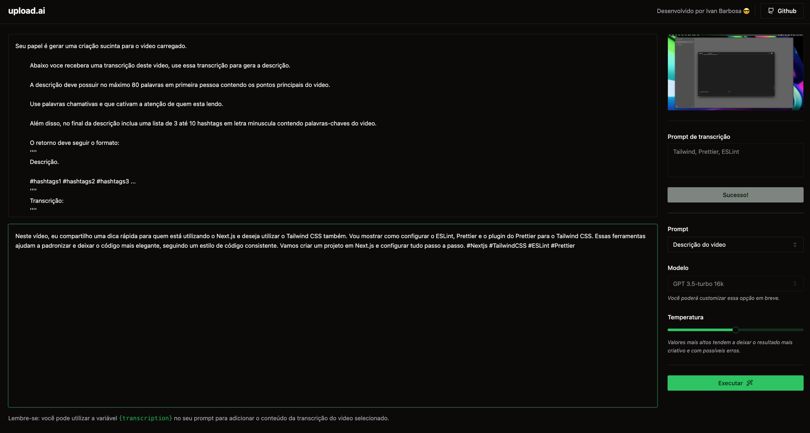
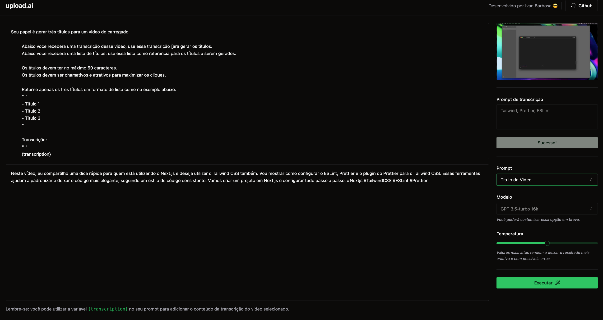

<h1 align="center"> UPLOAD IA WEB </h1>

Desenvolvido por Ivan Barbosa em conjunto com a Rocktseat 

  
  

 

## 💻 Projeto

- Desenvolvido uma page web, que recebe um video e interagindo com a API do chatgpt gera títulos, hashtags, e um resumo, do conteúdo do video.

## 🚀 Tecnologias

Esse projeto foi desenvolvido com as seguintes tecnologias:

- Node.js
- React / Vite
- JavaScript
- TypeScript
- Tailwind3.3.3

## 🔖 Dependências

Para o Cliente, usamos:
- React 12.2.*
- tailwind3.3.3
- Node.js v18.12.*
- axios 1.5.*
- ai 2.2.14
- lucide-react 0.276.*

## 💻 Clone e acesse o projeto
------------
    `https://github.com/ivanbs14/Future.git`

    or 

    `gh repo clone ivanbs14/Future`

## 💻 Configurar e executar cliente
------------
Acesse a pasta do cliente:

`cd upload_ai_web/`

Agora, instale e execute seu aplicativo

se ja tiver o node instalado na sua máquina:
 

`npm install -g pnpm`

`pnpm i`

`npm run dev`

Verifique se o aplicativo front-end esta em execução no local: http://localhost:5173/  (este endereço acima pode variar)

## Qualquer dúvida, envie um e-mail para

`ivanbarbosab@gmail.com`

---
